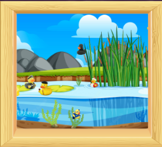

# :skull: DeathCoders :skull:

## :pencil: Descripción

Un juego de azar que consiste en ir matando de una en una a cada participante hasta que quede **una superviviente** :trophy:

El número de jugadoras es ilimitado.
No es necesario estar registrada, sólo inscribirse en la pantalla principal y cuando se hayan ingresado todos los nombres se acciona el botón de "Start".

El ámbito en el que se desarrolla este divertido juego es una tranquila laguna con patos. Cada pato representa a una jugadora :duck: y se irán eliminando :boom: poco a poco.

## :heavy_check_mark: Tecnologías
- HTML
- CSS
- JavaScript
- SASS (...)

## :hammer: Setup
## Nuestro logo

## Colaboradoras
- Iris Gomis
- Sharon 
- Mónica Raña
- Maricel Duarte (Mención especial) :smile:

